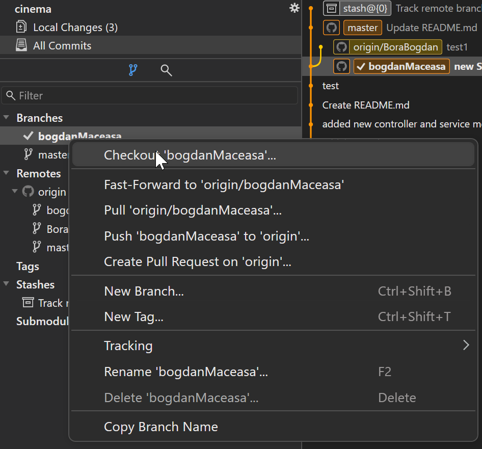

# cinema

# HOW TO ACCESS SWAGGER INTERFACE
To access swagger UI, please use the following URL when running the project on the local machine: http://localhost:8080/swagger-ui/index.html

# How to create a new branch and push it to Github

## Fetch & Pull the latest changes from GitHub

- Make sure that you perform a **Fetch** before **Pull**, otherwise the newest changes will not be pulled.

- Make sure you select the Stash and reapply local changes before clicking the **Pull** button.

## Create a new branch with your name & Push it to GitHub

- Right click on the **master** branch, select **New branch** and type your own *Branch name*
- Check the Checkout after create
- Please check that your active branch is the branch you have created yourself ( have a check mark in front )

## How to switch between branches

- After performing a **Fetch**, right click on the desired branch
- Click on Checkout  '*desired_branch_name*'

# How to Install PostgreSQL Server

- Download the postgreSQL Server kit from https://www.postgresql.org/download/
- Follow the install wizzard, **make sure you note down the password** this will be used to connect to the server, without it you will not be able to connect to it.
- Other configuration options can be left unchanged ( i.e the **port** - leave it to the default 5432 )
- After the installation is completed, you can skip launching the *Stack Builder* utilitary, so simply uncheck it and click Finish.

# How to create a SQL Database

- Search and open pgAdmin
- When it starts, you will be asked for the password - enter the password you set during the installation process
- The same will be asked when double-clicking on the PostgreSQL 14 server
- Left-click on the Databases and Create - Database
- Enter the desired name, leave everything else unchanged
- All done!

